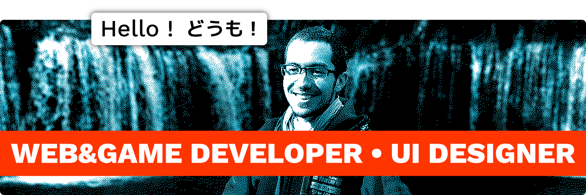

<h3 align="center"><b><a href="https://michaelhubert.me/">🏠 Portfolio</a></b> • <b><a href="https://blog.michaelhubert.me/">📰 Blog</a></b> • <b><a href="https://www.flickr.com/people/komanaki/">📷 Photos</a></b> • <b><a href="https://vimeo.com/michaelhubert">🎞️ Videos</a></b> • <b><a href="https://www.linkedin.com/in/michaelhubertme/">👔 LinkedIn</a></b></h3>
<h3 align="center"><b><a href="https://michaelhubert.me/jp/">🏠 ホームページ</a></b> • <b><a href="https://blog.michaelhubert.me/">📰 ブログ</a></b> • <b><a href="https://qiita.com/komanaki">📰 Qiita</a></b> • <b><a href="https://www.flickr.com/people/komanaki/">📷 写真</a></b> • <b><a href="https://vimeo.com/michaelhubert">🎞️ 動画</a></b> • <b><a href="https://www.wantedly.com/id/michaelhubert">👔 Wantedly</a></b></h3>

### It's me

* 🎓 5 years of **computer science education**, graduate of a Master of Science in video games development
* 🏢 8 years of **professional experience**, from small IT startups to a major French daily newspaper
* ✈️ 1 year **all around Japan** to travel, discover its way of life and work as a part-time civil worker
* 🕹️ Made a lot of **mini-games** during Global Game Jam, as well as a **3D rhythm-based exploration game** as my graduation project
* 👨‍🏫 **IT Teacher** for 2 years at the post-graduate school from I've graduated
* 👨‍🍳 **Waiter** in an Udon japanese restaurant in Paris to practice and enhance my Japanese skills

### I like to work with

* 🌐 Python, Django, JavaScript, React
* 🕹️ Unity, C#, Blender
* 🎨 Affinity Designer, Affinity Photo, Clip Studio Paint

### What I'm doing recently

* 📚 Studying **management and production systems**, rights and inequality at work, etc
* 🕹️ Working on [ReVolter Record](https://www.michaelhubert.me/revolter-record/), which consists of a **3D dungeon crawler** and a **visual novel** both made with Unity
* 💬 Writing the [KoeScript](https://github.com/komanaki/koescript) **scripting language** aimed for easy writing of dialogues in video games and such
* 🐍 Slowly discovering the most recent features of **Python 3.x**
* 🌐 Making some personal projets with **React**

### My passions

* 🕹️ Video games
* 🎵 Music
* 📷 Photography
* 🍜 Gastronomy
* ⚙️ Production/management systems
* 🎨 Design
* 🚆 Public transport
* 🎞️ Movies and animation
