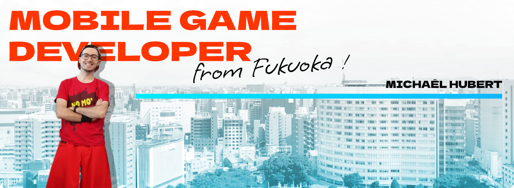

<h3 align="center"><b><a href="https://michaelhubert.me/">🏠 Portfolio</a></b> • <b><a href="https://blog.michaelhubert.me/">📰 Blog</a></b> • <b><a href="https://www.flickr.com/people/komanaki/">📷 Photos</a></b> • <b><a href="https://vimeo.com/michaelhubert">🎞️ Videos</a></b> • <b><a href="https://www.linkedin.com/in/michaelhubertme/">👔 LinkedIn</a></b></h3>
<h3 align="center"><b><a href="https://michaelhubert.me/jp/">🏠 ホームページ</a></b> • <b><a href="https://blog.michaelhubert.me/">📰 ブログ</a></b> • <b><a href="https://qiita.com/komanaki">📰 Qiita</a></b> • <b><a href="https://www.flickr.com/people/komanaki/">📷 写真</a></b> • <b><a href="https://vimeo.com/michaelhubert">🎞️ 動画</a></b> • <b><a href="https://www.wantedly.com/id/michaelhubert">👔 Wantedly</a></b></h3>

### It's me

* 🎓 5 years of **computer science education**, graduate of a Master of Science in video games development
* 🏢 7 years of **professional experience**, from small startups to a major daily newspaper
* ✈️ Been 1 year **in Japan** to travel around the country and discover its way of life
* 🕹️ Made a lot of **mini-games** at the annual Global Game Jam, as well as a **3D rhythm-based exploration game** as my graduation project
* 💻 Working as a **freelance** developer
* 👨‍🏫 Teaching **web development** at the post-graduate school that I've been

### I like to work with

* 🌐 Python, Django, JavaScript, React
* 🕹️ Unity, C#, Blender
* 🎨 Affinity Designer, Affinity Photo

### What I'm doing recently

* 📚 Studying **management and production systems**, rights and inequality at work, etc
* 🕹️ Creating a **3D dungeon crawler** and a **visual novel** in Unity to enhance my game development skills
* 💬 Writing a new **scripting language** aimed for dialogues in video games
* 🐍 Slowly discovering the most recent features of **Python 3.x**
* 🌐 Making some personal projets with **React**

### My passions

* 🕹️ Video games
* 🎵 Music
* 📷 Photography
* 🍜 Gastronomy
* ⚙️ Production/management systems
* 🎨 Design
* 🚆 Public transport
* 🎞️ Movies and animation
